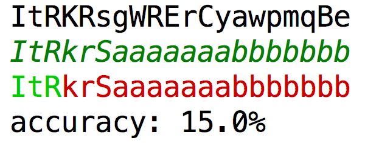

# 附：练习题 I

> 第一次习题： 2， 3， 51， 4， 5， 6

> 第二次习题： 9， 10， 13， 14， 15， 16， 19， 20， 21， 22

> 第三次习题： 7， 8， 24～33， 38， 44

1. 古典问题：有一对兔子，从出生后第3个月起每个月都生一对兔子，小兔子长到第三个月后每个月又生一对兔子，假如兔子都不死，问每个月的兔子总数为多少？

2. 判断101-200之间有多少个素数，并输出所有素数。素数：只能被1和它本身整除的正整数（1不是素数）

3. 打印出所有的“水仙花数”，所谓“水仙花数”是指一个三位数，其各位数字立方和等于该数本身。例如：153是一个“水仙花数’，因为153=1的三次方＋5的三次方＋3的三次方。

4. 将一个正整数分解质因数。例如：输入90，打印出90=2\*3\*3\*5。

5. 利用条件运算符的嵌套来完成此题：学习成绩>=90分的同学用A表示，60-89分之间的用B表示，60分以下的用C表示。

6. 输入两个正整数m和n，求其最大公约数和最小公倍数。

7. 输入一行字符，分别统计出其中英文字母、空格、数字和其它字符的个数。

8. 求s=a+aa+aaa+aaaa+aa…a的值，其中a是一个数字。例如2+22+222+2222+22222(此时共有5个数相加)，几个数相加有键盘控制。

9. 一个数如果恰好等于它的因子之和，这个数就称为’完数’。例如6=1＋2＋3.编程 找出1000以内的所有完数。

10. 一球从100米高度自由落下，每次落地后反跳回原高度的一半；再落下，求它在第10次落地时，共经过多少米？第10次反弹多高？

11. 有1、2、3、4个数字，能组成多少个互不相同且无重复数字的三位数？都是多少？

12. 企业发放的奖金根据利润提成。利润(I)低于或等于10万元时，奖金可提10%；利润高于10万元，低于20万元时，低于10万元的部分按10%提成，高于10万元的部分，可可提成7.5%；20万到40万之间时，高于20万元的部分，可提成5%；40万到60万之间时高于40万元的部分，可提成3%；60万到100万之间时，高于60万元的部分，可提成1.5%，高于100万元时，超过100万元的部分按1%提成，从键盘输入当月利润I，求应发放奖金总数？

13. 一个整数，它加上100后是一个完全平方数，再加上168又是一个完全平方数，请问该数是多少？

14. 输入某年某月某日，判断这一天是这一年的第几天？(闰年：	西元年份除以400余数为0的，或者除以4为余数0且除以100不为余数0的，为闰年。)

15. 输入三个整数x，y，z，请把这三个数由小到大输出。

16. 输出9\*9口诀。

17. 猴子吃桃问题：猴子第一天摘下若干个桃子，当即吃了一半，还不瘾，又多吃了一个第二天早上又将剩下的桃子吃掉一半，又多吃了一个。以后每天早上都吃了前一天剩下的一半零一个。到第10天早上想再吃时，见只剩下一个桃子了。求第一天共摘了多少。

18. 两个乒乓球队进行比赛，各出三人。甲队为a，b，c三人，乙队为x，y，z三人。已抽签决定比赛名单。有人向队员打听比赛的名单。a说他不和x比，c说他不和x，z比，请编程序找出三队赛手的名单。

19. 打印出如下图案（菱形）

           x
          xxx
         xxxxx
        xxxxxxx
         xxxxx
          xxx
           x
           
    > 要求只使用以下三种语句
    
        1. System.out.print(" ")
        2. System.out.print("x");
        3. System.out.println("x")

20. 有一分数序列：2/1，3/2，5/3，8/5，13/8，21/13…求出这个数列的前20项之和。

21. 求1+2!+3!+…+20!的和。

22. 利用递归方法求5!。

23. 有5个人坐在一起，问第五个人多少岁？他说比第4个人大2岁。问第4个人岁数，他说比第3个人大2岁。问第三个人，又说比第2人大两岁。问第2个人，说比第一个人大两岁。最后问第一个人，他说是10岁。请问第五个人多大？

24. 给一个不多于5位的正整数，要求：一、求它是几位数，二、逆序打印出各位数字。

25. 一个5位数，判断它是不是回文数。即12321是回文数，个位与万位相同，十位与千位相同。

26. 请输入星期几的第一个字母来判断一下是星期几，如果第一个字母一样，则继续 判断第二个字母。

27. 求100之内的素数。

28. 对10个数进行排序。

29. 求一个3*3矩阵对角线元素之和。

30. 有一个已经排好序的数组。现输入一个数，要求按原来的规律将它插入数组中。

31. 将一个数组逆序输出。

32. 取一个整数a从右端开始的4～7位。

33. 打印出杨辉三角形（要求打印出10行如下图）

            1
          1 2 1
         1 3 3 1
        .........（略）

34. 随机生成[1， 20]数10000次，使用两种方法实现（java.lang.Math，java.util.Random），并判断两种方法的效率和分布。

35. 输入数组，最大的与第一个元素交换，最小的与最后一个元素交换，输出数组。

36. 有n个整数，使其前面各数顺序向后移m个位置，最后m个数变成最前面的m个数。

37. 有n个人围成一圈，顺序排号。从第一个人开始报数（从1到3报数），凡报到3的人退出圈子，问最后留下的是原来第几号的那位。

38. 写一个函数，求一个字符串的长度，在main函数中输入字符串，并输出其长度。

39. 编写一个函数，输入n为偶数时，调用函数求1/2+1/4+…+1/n，当输入n为奇数时，调用函数1/1+1/3+…+1/n(利用指针函数)

40. 字符串排序。

41. 海滩上有一堆桃子，五只猴子来分。第一只猴子把这堆桃子凭据分为五份，多了一个，这只猴子把多的一个扔入海中，拿走了一份。第二只猴子把剩下的桃子又平均分成五份，又多了一个，它同样把多的一个扔入海中，拿走了一份，第三、第四、第五只猴子都是这样做的，问海滩上原来最少有多少个桃子？

42. 809\*??=800\*??+9\*??+1 其中??代表的两位数，8\*??的结果为两位数，9\*??的结果为3位数。求??代表的两位数，及809*??后的结果。

43. 求[0, 7]所能组成的奇数个数。

44. 一个偶数总能表示为两个素数之和。

45. 判断一个素数能被几个9整除。

46. 两个字符串连接程序。

47. 读取7个数[1, 50]的整数值，每读取一个值，程序打印出该值的个数。

48. 某个公司采用公用电话传递数据，数据是四位的整数，在传递过程中是加密的，加密规则如下：每位数字都加上5，然后用和除以10的余数代替该数字，再将第一位和第四位交换，第二位和第三位交换。

49. 计算字符串中子串出现的次数。

50. 有五个学生，每个学生有3门课的成绩，从键盘输入以上数据（包括学生号，姓名，三门课成绩），计算出平均成绩，况原有的数据和计算出的平均分数存放在磁盘文件”stud”中。

51. 斐波那契数列：1，1，3，5，8...，求f(n)

52. 求解汉诺塔 n 圆盘移动步骤

# 作业题

### 面向对象

编程题

1. 定义一个判断闰年的方法，在 main 方法中调用该方法判断输入的一个年份是否是闰年

2. 编写一个立方体类，包含这样的属性：长度、宽度、高度等信息，通过方法来计算它的体积

3. 定义一个人类，包含姓名、性别、年龄等信息。所有的变量必须私有。其他类只能通过该类的方法获取和修改。实例化一个人类，试着通过该类的方法修改实例化的人的信息
4. 将圆周率定义为常量，编写一个求圆面积的方法，调用此方法来求圆的面积

5. 定义一个学生类，包含三个属性（学号，姓名，成绩）均为私有的，分别给这三个属性定义两个方法，一个设置它的值，另一个获得它的值。然后在一个测试类里试着调用
6. 创建一个汽车类 Car，为其定义两个属性：颜色和型号，为该类创建两个构造方法：
第一个为无形参的构造方法，利用其中方法将颜色和型号设置为红色、轿车
。第二个为带参构造方法，利用构造方法将颜色和型号设置为黑色、轿车，另外为该类创建两个方法，分别用来显示颜色和型号
7. 修改上次写的人类，使它有多个构造方法，可以用姓名构造一个人，也可以用姓名，性别构造一个人
8. 构造一个日期类，包含年、月、日的属性和以下构造方法：
 - 不带参数
 - 包含年月日三个参数 
 - yyyy-MM-dd 格式的字符串
 - 提供存取日期的方法，实例化一个该类后，输入一个日期，可以计算出该日期是当年的第几天，要求计算天数的方法由日期类提供，可直接通过该类的实例去调用
9. 继承人类编写一个学生类，测试继承过来的属性和方法，并提供其它构造方法，并做如下试验：
 - 使用人类的构造方法参数格式去实例化一个学生
 - 删除人类中不带参数的构造方法，观察学生类还能不能使用，思考一下如果人类只有带参的构造方法，学生类应如何继承人类
 - 在学生类的构造方法中调用人类的构造方法
 - 在学生类的构造方法中先写一行其它代码，再去调用人类的构造方法
 - 在学生类的某一个构造方法里同时去调用学生类与人类的构造方法

思考题

1. 类有几种访问权限，各是什么

2. 方法有几种访问权限，各自的范围是

3. 什么是方法的覆盖与重载，两者有什么区别
4. 什么是构造方法，其书写格式是什么
5. 一个类中的构造方法能被该类中的其它方法调用吗，能被其它的构造方法调用吗，如果能，该如何调用
6. 如果两个类存在继承关系，父类没有不带参数的构造方法，子类可以不写构造方法吗，为什么

7. 写出修饰符 public protected default private 的权限访问范围

### 集合

编程题

1. 编写一个学生类，将学生的姓名，年龄，性别分别保存到 HashSet ArrayList Hashtable 中，并利用迭代器 Iterator 将姓名，年龄，性别打印出来
2. 使用 Map 接口的实现类完成员工工资(姓名→工资)的摸拟：
 - 添加几条信息
 - 列出所有的员工姓名
 - 列出所有员工姓名及其工资
 - 删除名叫 Tom 的员工信息
 - 输出 Jack 的工资，并将其工资改为 1500 元
 - 将所有工资低于 1000 元的员工的工资上涨 20%

思考题


1. 接口 Set 和  List 有什么相同和不同

2. Vector ArrayList LinkedList 类的作用是什么，它们有什么差别

3. 实现 Map 接口的类有哪些，它们的作用是什么，有什么差别

4. Iterator 类的作用是什么，如何使用

5. 输出一个 Hashtable 对象中所有的关键字与值的步骤是什么

### IO

编程题


1. 编写一个程序，在D盘根目录下创建一个以自己名称命名的文件夹，并在该文件夹下创建一个以自己名称命名的文本文件

2. 编写java程序，查看刚才所创建的文件的属性：包括是否能读、写、相对路径、绝对路径、长度,最后修改时间等

3. 编写程序向文本文件中写入自己的信息，格式为：
   ```
   姓名：tester
   性别：male
   年龄：18
   班级：201601
   ```
   将该信息读出后显示的屏幕上后把文件删除


4. 编写一个程序，将你所编写的.java文件读出显示在屏幕上

5. 编写程序，列出某一目录下的所有的JAVA文件
6. 编写程序，能将C盘的某一文件复制到D盘

7. 创建一个文件夹，分别向该文件夹下复制几个图片，文本文件和JAVA源程序

思考题

1. 在JAVA中流的概念是什么

2. JAVA中的流是怎么分类的

3. File类的作用是什么，它是一种流吗

# 补充题

1. 随机生成 6 个 [0-15] 的数字，作为彩票的中奖号码，要求最终的中奖号码没有重复数字，键盘录入 6 个 [0-15] 的数字，比较录入的数字和中奖号码相同的个数：
  - 小于3个，没有中奖
  - 当3个一样，中三等奖
  - 当4个一样，中二等奖
  - 当5个一样，中一等奖
  - 当全部一样，中特等奖
  - 在控制台打印中奖结果，样式如下：
        
    ```
    您的号码为 XX,XX,XX,XX,XX,XX，中了 X 等奖
    或者
    您的号码为 XX,XX,XX,XX,XX,XX，没有中奖
    ```
        
2. 项目根目录下已存在文件 data.txt，文件中存放用户名和密码，中间用逗号分隔，如：
  
  ```
  jack,1234
  tom,4567
  ```
  
  程序启动时：提示用户输入登录名和登录密码
   - 键盘录入用户名和密码
   - 在 data.txt 中获取用户名和密码，验证键盘录入的用户名和密码是否和 data.txt 中用户名密码匹配：是，控制台提示登录成功，并结束程序；否，控制台提示登录失败，并结束程序
3. 完成猜数字小游戏
  - 生成随机数 [1,100]
  - 用户键盘录入一个数字，与该随机数进行比较
    - 如果猜数正确，退出程序
    - 如果猜大了，打印"猜大了，请重新猜"，用户继续猜
    - 如果猜小了，打印"猜小了，请重新猜"，用户继续猜
  - 一共可以猜6次
  - 当用户6次都没猜中时，程序结束，将用户所猜过的所有结果打印到控制台
4. 在本地 E:/numbers.txt 添加如下两行数据：
  
  ```
  89,90,77,87,66,54,328,890,99
  65,72,12,77,2,96,54,27,89
  ```
  编写程序读取此文件中的所有数字，并将重复的数字只保留一个写入另一个文件 E:/result.txt 中，每个数字中间用逗号隔开；最后一个数字后不能有逗号
5. 使用键盘录入一个字符串，获取字符串中每一个字符出现的次数，要求统计结果格式为：

  ```
  a(5),b(4),c(3),d(2),e(1)
  ```

    将统计结果在控制台打印并将统计结果保存到项目根目录下的 result.txt 文件中
6. 定义类 Employee，包含如下字段：姓名，性别，销售额。此类要求包含无参构造方法，全参构造方法，所有字段的 get 和 set 方法，初始化如下几个 Employee 对象：
    
    ```
    张三,男,88907
    李四,男,76895
    王五,男,8900
    周六,男,90000
    赵七,女,79989
    ```
    
    - 将上述对象存储到 HashMap 集合中，要求使用泛型
    - 公司要求按照"销售额"计提奖金，提取标准：8 万元(不含)以下按 20% 提取；8 万元以上按 25% 提取 
    - 请计算所有人员应发奖金，结果取整数，并按如下格式打印：

    ```
    姓名  性别  销售额  计提百分比  奖金额
    xxx   x     xxxx   xx%        xxxx
    ``` 

7. 将 D:\aaa 下的所有 .txt 文件复制到 E:\aaa_copy，并且将 .txt 文件，重命名为 .java；定义 void copyFileAndRename(File srcFile, File destFile) 静态方法，方法内要求：
    - 如果目标目录不存在需要创建目标目录
    - 完成将源目录中的文件复制到目标目录下，并将后缀名修改为.java
    - 每复制完并更改后缀之后提示哪个文件复制完毕
    
   在main方法中定义源目录和目标目录，调用 copyFileAndRename 方法，复制完在控制台提示复制完毕
8. 需求:
   - 在项目根目录下新建一个文件：data.txt,键盘录入3个字符串验证码，并存入data.txt中，要求一个验证码占一行；
   - 键盘录入一个需要被校验的验证码，如果输入的验证码在 data.txt 中存在：在控制台提示验证成功，如果不存在控制台提示验证失败
9. 编程实现一个控制台打字测试，计算并输出正确率：
   
   
   


